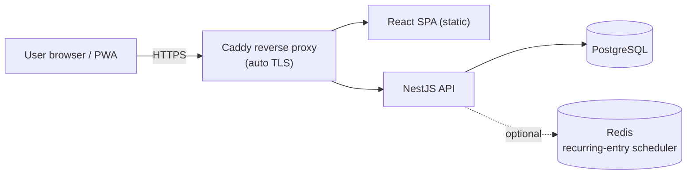
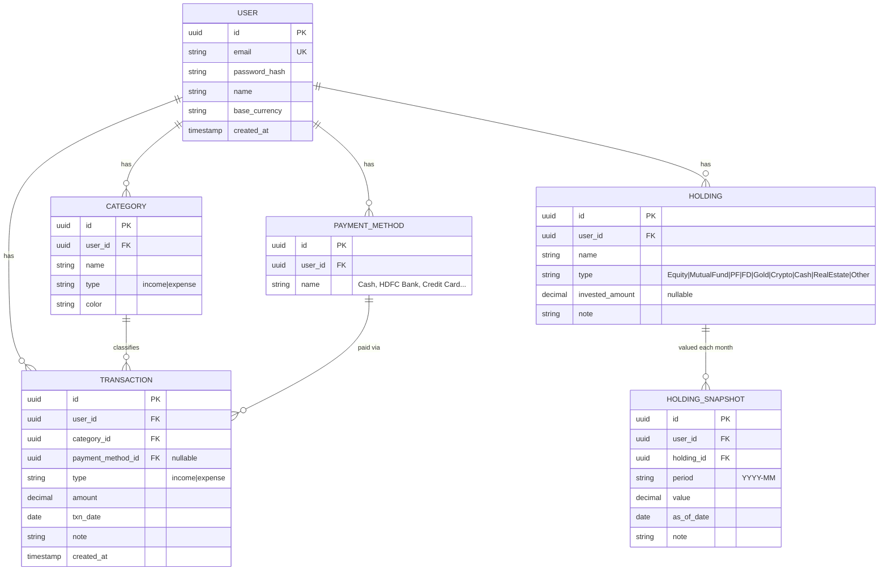

# Personal Finance & Portfolio Tracker — Specification & Technical Design

> Working name: **FinTrack** (rename freely). This document is the build spec — hand it to Claude Code as the source of truth.

---

## 1. Overview

A self-hostable, account-based web app where any user can sign up and:

- Record **daily income and expenses**.
- Maintain a **portfolio** (shares, PF/EPF, FDs, mutual funds, gold, etc.) by **manually updating each holding's value at the start of each month**.
- See a **dashboard** with the current portfolio plus two analytical views: **Monthly** and **Yearly**.

Deliberately kept simple. **No live market data, no price APIs, no background price jobs.** You enter portfolio values yourself once a month; the app does the tracking, math, and charts.

---

## 2. Goals & Non-Goals

### Goals
- Multi-user: anyone can register an account; each user's data is fully isolated.
- Fast daily entry of expenses/income.
- Monthly manual portfolio valuation → net-worth tracking over time.
- Dashboard: current portfolio snapshot + Monthly view + Yearly view.
- 100% free / open-source stack, self-hostable.

### Non-Goals (explicitly out of scope)
- ❌ Live/auto stock, NAV, or crypto prices.
- ❌ Bank or broker integrations / automatic transaction import (SMS, account aggregator).
- ❌ Trading, advice, or tax filing.
- ❌ Real-time anything. A monthly cadence for portfolio is by design.

---

## 3. Core Users & Key Stories

A single persona: an individual tracking their own money.

- As a user, I can **register and log in** securely.
- As a user, I can **add an expense or income** in a few taps (amount, category, date, optional note).
- As a user, I can **define my own categories** (Groceries, Rent, Salary, etc.).
- As a user, I can **list my portfolio holdings** (e.g. "HDFC Shares", "EPF", "SBI FD").
- As a user, at the **start of a month I update each holding's current value**; the app stores that month's snapshot.
- As a user, I see a **dashboard** with my latest net worth, asset allocation, and recent activity.
- As a user, I can switch to a **Monthly view** (income vs expense, category breakdown, savings, portfolio value that month).
- As a user, I can switch to a **Yearly view** (12-month trend of income/expense/savings and net-worth growth).

---

## 4. Functional Requirements

### 4.1 Authentication & Accounts
- Email + password registration and login.
- Passwords hashed with **Argon2id** (never stored in plaintext).
- Session via **JWT access token (short-lived) + refresh token (rotating)**.
- Password reset via email link (can be deferred to v2 — see roadmap).
- Each user sees **only their own** transactions and portfolio.

### 4.2 Daily Expense / Income Tracking
- Create / edit / delete a **transaction**: `type` (income | expense), `amount`, `date` (defaults to today), `category`, optional `note`, optional `payment method`.
- List transactions with filters: date range, type, category, text search.
- Quick-add form optimised for speed (default date = today, last-used category remembered).
- **Optional (v1):** recurring entries (e.g. salary on the 1st, rent on the 5th, SIP) that the app can auto-create on schedule so you don't re-type them daily/monthly.
- **Optional (v1):** CSV import of transactions.

### 4.3 Categories
- User-defined categories, each tagged as income or expense, with optional colour/icon.
- A small default set seeded on signup (Salary, Groceries, Rent, Utilities, Transport, Dining, Investment, Misc) — editable.

### 4.4 Portfolio (manual monthly snapshots) — the simplified core
- A user maintains a list of **holdings**. Each holding: `name`, `type` (Equity | Mutual Fund | EPF/PF | FD | Gold | Crypto | Cash | Real Estate | Other), optional `note`, optional `invested_amount` (what you put in, for P&L).
- For each **period (month, `YYYY-MM`)**, the user records a **value snapshot** per holding: the current worth of that holding.
- The app derives:
  - **Net worth for a month** = sum of all holding values for that month.
  - **Month-over-month change** (₹ and %).
  - **Gain/loss** per holding if `invested_amount` is provided (`value − invested`).
- Start-of-month workflow: a single "Update this month's portfolio" screen that pre-fills last month's values so the user just edits the numbers that changed.
- No automatic valuation. Values are whatever the user types.

### 4.5 Dashboard — Current Portfolio
- Header: **latest net worth**, change vs previous month.
- **Asset allocation** donut by holding type.
- Holdings table: name, type, current value, invested (if set), gain/loss, % of portfolio.
- Recent transactions strip + this-month income/expense/savings summary.

### 4.6 Monthly View
- Month picker.
- Total **income**, total **expense**, **net savings** (income − expense) for that month.
- **Spend by category** (donut or bar).
- **Daily spend trend** line for the month.
- **Portfolio value** recorded for that month + change vs prior month.

### 4.7 Yearly View
- Year picker.
- 12-month bars: income / expense / savings per month.
- **Savings rate** for the year.
- **Net-worth growth** line across the 12 monthly snapshots.
- Top spending categories for the year.

### 4.8 Currency
- Default **INR**, single currency, formatted with Indian grouping (e.g. ₹1,23,456). Multi-currency is out of scope for v1.

---

## 5. Non-Functional Requirements

- **Multi-tenancy / isolation:** every data row carries a `user_id`; all queries are scoped to the authenticated user at the service layer. Optionally enforce Postgres **Row-Level Security** as defence-in-depth.
- **Security:** HTTPS only, Argon2id passwords, rotating refresh tokens, rate limiting on auth, input validation on every endpoint, security headers, secrets via environment variables only.
- **Privacy:** financial data is sensitive — no third-party analytics by default; daily DB backups.
- **Performance:** dataset is small (one user's personal finances). No exotic scaling needed. Index on `(user_id, date)` and `(user_id, period)`.
- **Portability:** the whole thing runs from one `docker compose up`.

---

## 6. Recommended Technology Stack (free / open-source / self-hostable)

Opinionated, single-language (TypeScript) end-to-end to reduce moving parts. Alternatives noted.

| Layer | Recommendation | Why | Alternative |
|---|---|---|---|
| Frontend | **React + TypeScript (Vite)**, Tailwind CSS, shadcn/ui, **Recharts**, TanStack Query, React Hook Form + Zod | Fast, huge ecosystem, great for dashboards/charts | SvelteKit, Vue+Nuxt |
| Backend | **NestJS (TypeScript)** + **Prisma ORM**, REST | Structured, batteries-included, clean architecture | **FastAPI (Python)** — good fit if you want to flex your Python; Express |
| Database | **PostgreSQL 16** | Free, rock-solid, great date/aggregate support | MariaDB / SQLite (single-user only) |
| Auth | JWT (access + refresh) with Argon2id | Self-contained, no vendor | Lucia, Auth.js |
| Packaging | **Docker + Docker Compose** | One-command deploy anywhere | — |
| Reverse proxy / TLS | **Caddy** (automatic HTTPS) | Zero-config certificates | Nginx + Certbot |

> If you'd rather go Python end-to-end (you're upskilling in it anyway): **FastAPI + SQLModel/SQLAlchemy + PostgreSQL**, with the same React frontend. Both are fully supported by Claude Code.

Everything above is free and open-source. No paid service is required to build or run this.

---

## 7. High-Level Architecture



- Frontend is a static bundle served by Caddy (or a CDN). It talks to the API over REST.
- API enforces auth + per-user scoping, owns all business logic, talks to Postgres.
- Redis is **optional** — only if you implement the recurring-entries scheduler. Skip it for MVP.

---

## 8. Data Model



Notes:
- **`HOLDING_SNAPSHOT`** is the heart of the simplified portfolio: one row per holding per month. Net worth for a month = `SUM(value) WHERE period = 'YYYY-MM'`.
- Unique constraint on `(holding_id, period)` so each holding has one value per month.
- Recurring entries (if built) add a `RECURRING_RULE` table; refresh tokens add a `REFRESH_TOKEN` table. Both optional.
- Index suggestions: `transaction(user_id, txn_date)`, `holding_snapshot(user_id, period)`.

---

## 9. API Surface (REST, all under `/api`, all require auth except auth routes)

```
Auth
  POST   /auth/register
  POST   /auth/login
  POST   /auth/refresh
  POST   /auth/logout

Categories
  GET    /categories
  POST   /categories
  PATCH  /categories/:id
  DELETE /categories/:id

Payment methods
  GET    /payment-methods
  POST   /payment-methods
  ... (CRUD)

Transactions
  GET    /transactions?from=&to=&type=&categoryId=&q=
  POST   /transactions
  PATCH  /transactions/:id
  DELETE /transactions/:id

Holdings
  GET    /holdings
  POST   /holdings
  PATCH  /holdings/:id
  DELETE /holdings/:id

Portfolio snapshots
  GET    /portfolio/:period            # all holding values for a month, e.g. 2026-05
  PUT    /portfolio/:period            # bulk upsert this month's values
  GET    /portfolio/networth?from=&to= # net worth time series

Dashboard / analytics
  GET    /dashboard/summary            # current portfolio + this-month totals
  GET    /analytics/monthly?period=YYYY-MM
  GET    /analytics/yearly?year=YYYY
```

Aggregations (category breakdowns, monthly totals, net-worth series) are computed in SQL `GROUP BY` queries, not in app code where avoidable.

---

## 10. Security Design

- **Passwords:** Argon2id, per-user salt (library default).
- **Tokens:** short-lived access JWT (~15 min) in memory; rotating refresh token (~7–30 days) in an HttpOnly, Secure, SameSite cookie. Invalidate refresh tokens on logout.
- **Authorization:** every query filters by `req.user.id`; never trust an ID from the client without an ownership check.
- **Validation:** Zod / class-validator DTOs on every endpoint.
- **Hardening:** rate-limit auth routes, security headers (Helmet), strict CORS allowlist, HTTPS enforced by Caddy.
- **Secrets:** `.env` only, never committed. Document required vars in `.env.example`.
- **Backups:** nightly `pg_dump` to a separate volume / object storage.

---

## 11. Deployment & Hosting (free options)

Ship as Docker Compose with services: `web` (static frontend via Caddy), `api`, `db` (Postgres), and optionally `redis`.

**Free hosting paths (verified, 2026):**

- **Best "always free" self-host:** an **Oracle Cloud Always Free** VM (generous ARM Ampere allowance) running Docker Compose, with **Caddy** for automatic TLS. Oracle Cloud Always Free falls into the self-managed VPS/IaaS category — you get a virtual machine and full root access. This is the most genuinely-free way to host the whole stack long-term.
- **Managed Postgres free tier** (if you don't want to run the DB yourself): Supabase or Neon free tier, with the app hosted elsewhere.
- **Frontend (if you split it out):** Cloudflare Pages, Netlify, or Vercel. GitHub Pages, Cloudflare Pages, Netlify, and Vercel offer genuinely free tiers for static sites and frontend apps — no credit card, no expiring credits, no trial periods.
- **Simple container PaaS (with caveats):** Render has a free tier, but free services spin down after inactivity, which means cold starts — fine for a personal app you don't mind waiting ~1 minute to wake.

**What to avoid expecting for free:** Railway and Fly.io now run on trial/usage-based models — great for testing but no longer true "always free" platforms. Railway gives new users a one-time trial credit, and Fly.io offers trial credits with the original free VM tier grandfathered for legacy users only.

**Recommendation:** Oracle Cloud Always Free VM + Docker Compose + Caddy + Cloudflare DNS. Truly free, full control, and the whole app (frontend + API + Postgres) lives in one place. A self-hosted PaaS like **Coolify** on that same VM gives you a nice deploy UI if you want one.

---

## 12. Suggested Repository Layout (monorepo)

```
fintrack/
├─ docker-compose.yml
├─ .env.example
├─ Caddyfile
├─ apps/
│  ├─ api/            # NestJS + Prisma
│  │  ├─ prisma/schema.prisma
│  │  └─ src/{auth,transactions,categories,holdings,portfolio,analytics}/
│  └─ web/            # React + Vite
│     └─ src/{pages,components,features,lib,api}/
└─ README.md
```

---

## 13. Phased Roadmap

**MVP (build first)**
- Auth (register/login/refresh), per-user isolation
- Categories + transactions (daily income/expense) with filters
- Holdings + monthly snapshot entry (the start-of-month update screen)
- Dashboard: current portfolio + this-month summary
- Monthly view

**v1**
- Yearly view + net-worth growth chart
- Recurring entries (optional Redis scheduler)
- CSV import of transactions
- Password reset via email
- Budgets per category (optional)

**v2 (nice-to-have)**
- PWA / installable mobile experience
- Export to PDF/Excel reports
- Two-factor auth
- Multi-currency

---

## 14. Open Decisions to Confirm Before Coding

1. **App name** — keep "FinTrack" or your own?
2. **Stack** — TypeScript end-to-end (NestJS) as recommended, or Python backend (FastAPI) since you're learning it?
3. **Recurring entries in MVP or v1?** Affects whether we add Redis now.
4. **Hosting target** — Oracle Cloud Always Free VM (recommended), or somewhere else?
5. **Email** — needed for password reset; do you have an SMTP provider, or defer reset to v2?

Once you confirm these, the next step is generating the repo scaffold (schema + auth + transactions) with Claude Code, module by module.
